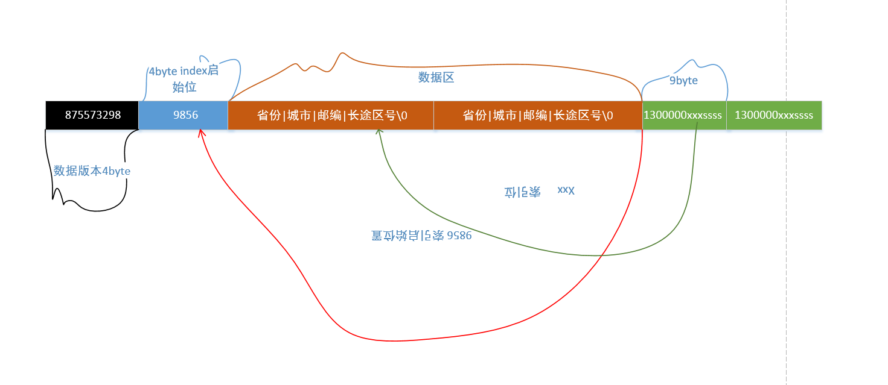
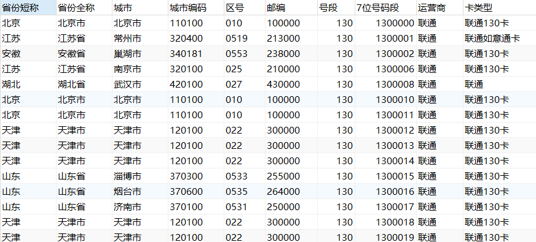

```

         PhoneNumberSearcher phoneNumberSearcher = new PhoneNumberSearcher();
         Optional<PhoneNumberInfo> lookup = phoneNumberSearcher.lookup("15951590000");
         if (lookup.isPresent()){
             System.out.println(lookup);
         }
         // Optional[PhoneNumberInfo{phoneNumber='15951590000', attribution=Attribution{province='江苏', city='宿迁', zipCode='223800', areaCode='0527'}, isp=ISP{cnName='中国移动', value=1}}]

       
```


## 数据文件
[手机号归属地数据文件](./手机号归属地.xlsx)

## 使用

### 使用已生成的dat文件处理数据
具体参考phone-number-search
### 使用提供的数据文件生成压缩文件
使用提供的手机号归属地数据文件生成压缩文件，结构参考上图，也可以自己定义
压缩文件格式
### 使用提供的数据文件放到缓存中
将提供的手机号归属地文件存入缓存中，提供接口

## 数据文件大小
数据总共44w+

如果数据缺失或者不对可以取网络上收集。